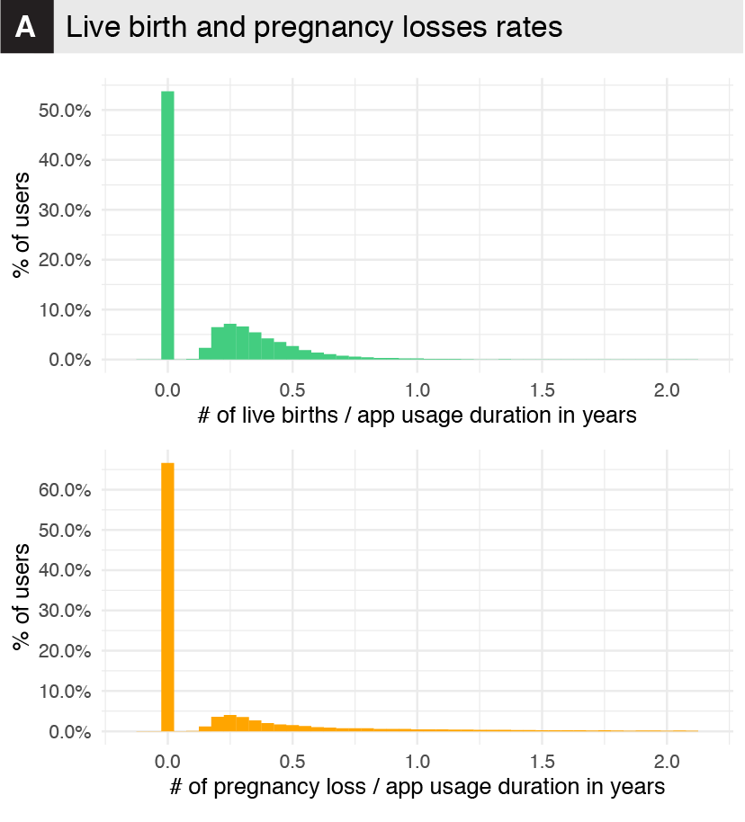

# Abstract

**Background**

Millions of women use mobile phone apps to track their menstrual cycles, fertility and pregnancies by reporting fertility body-signs and ovulation or pregnancy test results. 

**Objectives**

Provide a high-resolution description of pregnancy outcomes from self-reported records on a fertility app.

**Methods**

We used a large retrospective de-identified dataset from the Kindara app, including 135,611 users of age 30.8 ± 4.68 with 1,716,012 cycles. All of these users had logged at least one positive pregnancy test while using the app. Pregnancies were detected from reported positive pregnancy tests. The most likely pregnancy outcomes were estimated from these pregnancies’ duration.

**Results**

For 54% of the users, pregnancy durations were un-identifiable because of inconsistent app use. For the remaining 46% (app usage duration: 3.03±1.59 years), 36% of pregnancies ended in a birth at term; 2% in a pre-term birth (5% of all live births); 15% were false positive or mis-interpreted tests, mis-clicks, or ended in very early pregnancy losses;  20% ended in first-trimester losses; and 10% in second-trimester losses. The outcome of the remaining 18% could not be identified as some users did not use the app for over 1.5 years after getting pregnant. About 52% of users never experienced any loss whilst using the app, while 6% experienced 2 or more losses.

**Conclusion(s)**

The pregnancy loss rates were higher than previously reported for the US population, where most users are based, while pre-term birth rates were lower. These differences could be explained by biases in this self-selected population or inconsistent tracking behaviors. Despite these potential biases, the scale of the dataset allows for a higher resolution view of the distribution of pregnancy duration than previously possible. This study thus demonstrates the utility and limitations of fertility tracking apps, as a promising new tool for studying pregnancy outcomes in large prospective cohorts.

# Figures

## Figure 1

Data collection, Tracking examples, Schematics for the determination of new menstrual cycle starts and pregnancy detection.

## Figure 2

Pregnancy Outcomes

## Figure 3

Live Birth and Pregnancy Losses Rates

## Figure 4

Predictors of pregnancy losses

# Pre-print

The current version of the paper can be downloaded on !! [medRxiv](XXX) !!

# Peer-reviewed published article

Coming soon

# Code and Data

Code and aggregated data to reproduce the figures can be found and downloaded on the github repo [PL-Public-Repo](https://github.com/lasy/PL-Public-Repo) .

Specifically, click [here](https://lasy.github.io/PL-Public-Repo/Code/Pregnancy_Outcomes_FIGURES.html)  for the rendered  [Rmd](https://github.com/lasy/PL-Public-Repo/blob/master/Code/Pregnancy_Outcomes_FIGURES.Rmd) (R code // R markdown) used to generate the Figures.

This link will bring you to the rendered R markdown for the full analysis of the data: [Analysis](https://lasy.github.io/PL-Public-Repo/Code/Pregnancy_Outcomes_ANALYSIS.html)

# Contact
Any question or request can be addressed to Laura Symul 

[lsymul@stanford.edu](mailto:lsymul@stanford.edu) 

[laurasymul@gmail.com](mailto:laurasymul@gmail.com) 

[lsy.works](http://lsy.works/)

[twitter](https://twitter.com/LauraSymul) @LauraSymul

