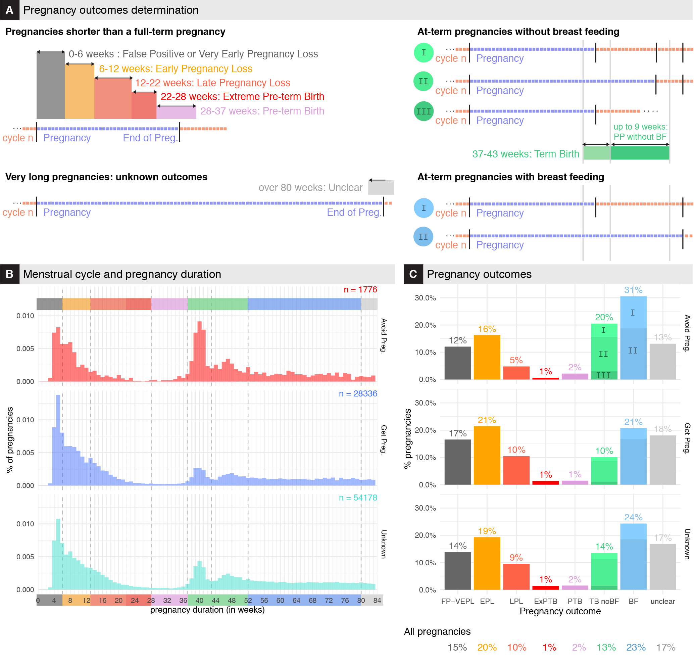

# Abstract

**Background**

In the last decade, millions of women have started to use mobile phone apps to track their menstrual cycles. Some of these women are using these apps to monitor their fertility and their pregnancy attempts by tracking fertility awareness body-signs such as their temperature or cervical mucus and the results of ovulation or pregnancy tests. These data offer an unprecedented opportunity to improve our knowledge of pregnancy outcomes and fertility history of these app users. 

**Objectives**

Provide a high-resolution description of pregnancy outcomes from self-reported records on a fertility mobile phone app.

**Methods**

We used a large retrospective de-identified dataset from the Kindara app, including 135,611 users of age 30.8 ± 4.68 with 1,716,012 cycles. All of these users had logged at least one positive pregnancy test while using the app. Pregnancies were detected from positive pregnancy tests logged by users. For 54% of these users, the pregnancy durations could not be identified either because users stopped using the app after getting pregnant or because the pregnancy tests were logged before any cycle had been logged, rendering the evaluation of the conception time impossible. For the remaining 46%, their most likely pregnancy outcomes were estimated based on the duration of these pregnancies while using the app (app usage duration for these users: 3.03 ± 1.59 years). The reproductive objectives of the users were estimated based on goals that users declared upon first use of the app, and on the users’ sexual behavior in the three cycles preceding a pregnancy as well as during the conception cycle to account for users who may have changed their reproductive intentions while using the app.

**Results**

It was found that 36% of these cycles with a positive pregnancy test end up in a birth at term; that 2% lead to pre-term births (5% of all live-births); that 15% of these cycles were either false positive tests, mis-interpreted tests, incorrect data entries, or ended up in very early pregnancy losses;  that 20% of these cycles end up in a 1st trimester pregnancy loss; and that  10% ended in a 2nd trimester pregnancy loss. The outcome of the remaining 18% could not be confidently identified as some users did not use the app for over 1.5 years after getting pregnant. We also found that about 52% of the users with at least one positive pregnancy test never experienced any pregnancy loss whilst using the app, while 6% of the users experienced 2 or more pregnancy losses.

**Conclusion(s)**

The pregnancy loss rates among these app users were higher than previously reported for the US population, which is where most app users are based, while the pre-term birth rates were lower. These differences could be explained by biases in this self-selected population, by inconsistent tracking behaviors, or perhaps by factors related to the behaviors of women who experience a pre-term birth. On the other hand, despite these potential biases, the scale of the dataset allows for a higher resolution view of the distribution of pregnancy duration than previously possible. This study thus demonstrates both the utility and the limitations of fertility tracking apps, as a promising new tool for studying pregnancy outcomes in large prospective cohorts, and can lead to enhanced designs of future studies relying on digitally collected data.  

# Figures

## Figure 1

Data collection, Tracking examples, Schematics for the determination of new menstrual cycle starts and pregnancy detection.

## Figure 2

Pregnancy Outcomes

## Figure 3

Live Birth and Pregnancy Losses Rates

## Figure 4

Predictors of pregnancy losses

# Pre-print

The current version of the paper can be downloaded on !! [medRxiv](XXX) !!

# Peer-reviewed published article

Coming soon

# Code and Data

Code and aggregated data to reproduce the figures can be found and downloaded on the github repo [PL-Public-Repo](https://github.com/lasy/PL-Public-Repo) .

Specifically, click [here](https://lasy.github.io/PL-Public-Repo/Code/Pregnancy_Outcomes_FIGURES.html)  for the rendered  [Rmd](https://github.com/lasy/PL-Public-Repo/blob/master/Code/Pregnancy_Outcomes_FIGURES.Rmd) (R code // R markdown) used to generate the Figures.

This link will bring you to the rendered R markdown for the full analysis of the data: [Analysis](https://lasy.github.io/PL-Public-Repo/Code/Pregnancy_Outcomes_FIGURES.html)

# Contact
Any question or request can be addressed to Laura Symul 

[lsymul@stanford.edu](mailto:lsymul@stanford.edu) 

[laurasymul@gmail.com](mailto:laurasymul@gmail.com) 

[lsy.works](http://lsy.works/)

[twitter](https://twitter.com/LauraSymul) @LauraSymul

